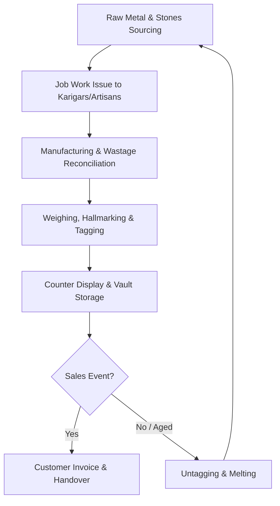
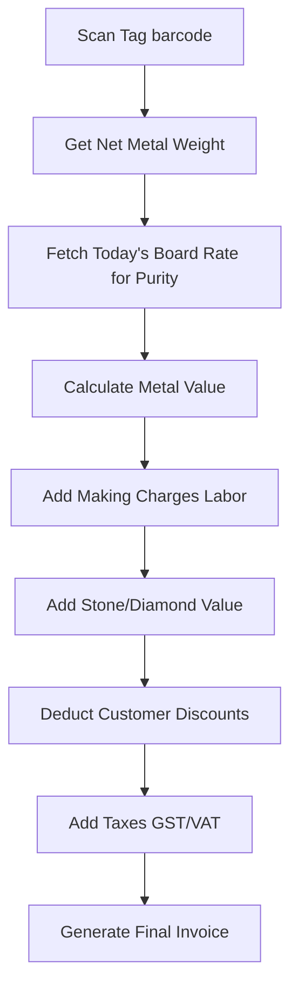

# Jewellery Business Domain Guide

This document provides a comprehensive overview of the jewellery business domain, specifically structured for software engineers building the **JewelMind-AI Business Intelligence (BI) Copilot**. 

Understanding these domain-specific concepts is critical for designing databases, writing analytics engines, and defining AI tool constraints.

---

## 1. Jewellery Business Terminology

Unlike standard retail (where inventory is SKU-based and static), jewellery retail operates primarily on **serialized, weight-based inventory** with prices that fluctuate daily based on global commodity markets.

| Term | Definition | BI System Importance |
| :--- | :--- | :--- |
| **Karat (K) / Purity** | The purity of gold, measured out of 24 parts. 24K is 99.9% pure, 22K is 91.6% (known as 916 gold), 18K is 75.0%, and 14K is 58.3%. | Essential for pricing. Board rates are defined per-karat (e.g., 22K rate vs. 18K rate). |
| **Fineness** | Purity expressed in parts per thousand (e.g., 916 fineness = 22K gold). | Standardized purity format used in cataloging and hallmarking. |
| **Gross Weight** | The total weight of a finished jewellery piece, including metal, stones, enamel, lacquer, and beads. | Used for physical shipping, logistics, and counter audits. |
| **Stone Weight** | The total weight of all diamonds, gemstones, pearls, or beads embedded in the piece. Often measured in **Carats (ct)**, where $1 \text{ ct} = 0.2 \text{ grams}$. | Deducted from Gross Weight to determine Net Weight. |
| **Net Weight** | The weight of the precious metal alone. $$\text{Net Weight} = \text{Gross Weight} - \text{Stone Weight (in grams)}$$ | The primary value driver for the metal component of the sale. |
| **Wastage (Loss)** | Metal lost as dust or scrap during manufacturing (polishing, cutting, soldering). Traditionally added to billing as a percentage of Net Weight (e.g., 5% to 10% wastage). | Increases the effective metal cost of the piece. |
| **Serialized Tagging** | Assigning a unique identifier (barcode/RFID Tag ID) to *every single finished piece* of jewellery. | Since no two handmade items have the exact same net weight or stone grades, each item must be tracked as a unique row in the database, not as a bulk SKU. |
| **Hallmarking** | An official certification of purity stamped on the jewellery (e.g., BIS Hallmark in India). | A compliance marker that must be stored in the product registry. |

---

## 2. Product Lifecycle

The lifecycle of a jewellery item spans from raw material acquisition to customer sale or refining (recycle). 



### Key Phases:
1. **Design & Sourcing**: Procurement of pure gold bullion (24K bars) and loose diamonds/stones from wholesalers.
2. **Manufacturing (Job Work)**: Materials are issued to artisans (*Karigars*). The artisan crafts the piece, returns the finished article along with any scrap metal, and is paid a fabrication fee (making charges).
3. **Cataloging & Tagging**: The finished piece is weighed to find its exact Gross, Stone, and Net weights. A barcode/RFID tag is printed and attached, recording the exact metadata in the ERP.
4. **Stocking & Security**: Items are displayed on showroom counters. At night, they are moved to high-security vaults.
5. **Sales or Recycle**: Sold to a customer, or—if unsold for a long time—melted down back into pure gold bullion to be reused.

---

## 3. Core Business Flows

### A. Purchase & Procurement Flow
Retailers acquire stock through three main pathways:
*   **Direct Bullion Purchase**: Buying standard 24K gold bars from banks or bullion merchants.
*   **Job Work**: Issuing raw gold and stones from inventory to a manufacturer, and paying only the making charge upon receiving the finished, tagged item.
*   **Consignment (Approval Stock)**: Vendors place their finished items in the retailer's showroom. The retailer does not own the stock and only pays the vendor when the item is sold to a customer. Unsold consignment stock is returned to the vendor.

### B. Inventory Flow & Audits
*   **Counter Transfers**: Moving items between showrooms or counters (e.g., shifting a necklace from the "Gold Section" to the "Bridal Section").
*   **Daily Weight Auditing**: A critical security control. Every morning and night, staff weigh entire trays of jewellery. The system compares the physical scale weight against the sum of the system weights for the tags assigned to that tray. Discrepancies of even 0.01g trigger investigation.
*   **Melting Flow**: When stock is retired, it is untagged, the stones are extracted (and returned to stone inventory), and the metal is melted and refined back to 24K gold.

### C. Sales Flow
A jewellery sale differs from standard retail because the price is calculated dynamically at the time of invoicing:



$$\text{Final Sale Price} = (\text{Net Weight} \times \text{Today's Metal Rate per Gram}) + \text{Making Charges} + \text{Stone Value} - \text{Discounts} + \text{Taxes}$$

---

## 4. Key Pricing Components

To build an accurate BI system, you must track the following revenue components separately:

### Metal Rates
*   **Board Rate**: The daily retail rate set by the showroom (usually aligned with local jeweller associations) for different purities (24K, 22K, 18K).
*   **Purity Calculation**: If the 24K rate is $R$, the 22K rate is calculated as:
    $$\text{Rate}_{22K} = R \times \frac{22}{24} + \text{Retail Premium}$$

### Making Charges (Labor Cost)
The fee charged to the customer for the craftsmanship of the piece. It is structured in three ways:
1.  **Per Gram of Net Weight**: e.g., \$10 per gram. (Total making charge = $\text{Net Weight} \times \$10$).
2.  **Percentage of Metal Value**: e.g., 12% of the metal cost.
3.  **Flat Charge per Piece**: e.g., a fixed \$200 labor charge for a ring.

> [!TIP]
> **BI Insight**: Making charges are the retailer's primary margin lever. While metal prices are dictated by the global market, making charges are fully controlled by the retailer and carry a near-100% margin (minus the Karigar fee).

### Discounts
Discounts are rarely applied flatly across the entire invoice. They are highly targeted:
*   **Discount on Making Charges**: e.g., "50% off on making charges" (most common promotion).
*   **Discount on Diamond/Stone Value**: e.g., "10% off on diamond per-carat rate".
*   **Flat / Invoice Discount**: Rounding off the bill or a negotiated discount at checkout.

> [!WARNING]
> For BI margins, always attribute discounts to their specific component (Metal vs. Making vs. Stones) to avoid distorting specific margin metrics.

---

## 5. Financial & BI Metrics

### Revenue Breakdown
For BI analytics, total revenue must be broken down by source components:
$$\text{Revenue} = \text{Metal Sales} + \text{Making Charge Sales} + \text{Stone Sales} - \text{Discounts}$$
*Note: Value-Added Tax (VAT/GST) collected is a liability and is excluded from Revenue.*

### Cost of Goods Sold (COGS)
COGS represents the direct costs of the sold items:
$$\text{COGS} = \text{Metal Cost} + \text{Artisan Labor Cost Paid} + \text{Stone Cost} + \text{Wastage Cost}$$

### Gross Profit & Margins
$$\text{Gross Profit} = \text{Revenue} - \text{COGS}$$
$$\text{Gross Margin \%} = \frac{\text{Gross Profit}}{\text{Revenue}} \times 100$$

In jewellery BI, we track margins at three distinct levels:
1.  **Metal Margin**: Very thin (often 1-3%), because metal price changes are passed directly to the customer.
2.  **Making Charge Margin**: High (often 40-60%), representing the difference between the making charge billed to the customer and the labor fee paid to the *Karigar*.
3.  **Stone Margin**: High (often 30-50%), especially for diamonds and precious gemstones.

---

## 6. Inventory Performance & Aging

Precious metals do not rot, rust, or go out of style quickly, but holding jewellery inventory is extremely expensive due to the high capital tied up in gold (high **carrying cost**).

### Inventory Ageing Buckets
BI systems categorize inventory based on the number of days elapsed since the item was tagged:
*   **0–90 Days**: Fresh stock (high sales potential).
*   **91–180 Days**: Medium stock.
*   **181–365 Days**: Slow stock.
*   **>365 Days**: Aged Stock / Candidate for melting.

### Stock Performance Categories
*   **Fast Movers**: Items with a high **Sell-Through Rate (STR)** or low **Days Sales of Inventory (DSI)**. These are designs that sell within 30–60 days. (e.g., light-weight daily wear chains, wedding bands).
*   **Slow Movers**: Items that remain in stock for 6 to 12 months. They are necessary to showcase variety but tie up capital.
*   **Dead Stock**: Items unsold for $>365$ days.
    > [!IMPORTANT]
    > **BI Action Rule**: If an item becomes dead stock, its carrying cost (interest on gold value) often exceeds its profit margin. BI systems trigger recommendations to melt the item down, recoup the gold, and manufacture a new design.

---

## 7. Valuation & Commodity Risk Metrics

Because gold prices fluctuate constantly, valuing inventory and managing risk is a daily financial task.

### Weighted Acquisition Rate (WAR)
The average cost per gram at which the current gold inventory was acquired. This is used to value inventory and calculate COGS:
$$\text{WAR} = \frac{\sum_{i} (\text{Purchase Weight}_i \times \text{Purchase Price per Gram}_i)}{\sum_{i} \text{Purchase Weight}_i}$$

### Metal Exposure
Precious metals are volatile. If a jeweler holds gold, they are exposed to the risk of price drops.

*   **Long Position (Unhedged Stock)**: 
    *   The retailer physically owns gold inventory that has not been sold yet and is not hedged.
    *   *Risk*: If gold prices fall, the value of the inventory drops, resulting in a mark-to-market loss.
*   **Short Position (Gold Liability)**:
    *   The retailer has committed to delivering gold to a customer (e.g., through an advance booking scheme or gold savings scheme where the rate is locked in) but has not yet purchased the physical gold.
    *   *Risk*: If gold prices rise, the retailer must buy the gold at a higher price to fulfill the order, causing a loss.

### Hedging
The practice of neutralizing metal exposure. Jewellers do this by:
1.  **Commodity Futures**: Selling gold futures contracts on exchanges (like MCX) to offset physical stock drops, or buying contracts to cover advance customer bookings.
2.  **Gold Metal Loans (GML)**: Retailers borrow physical gold from banks instead of buying it. They pay interest on the gold weight. When they sell a piece to a customer, they purchase gold at that day's rate from the bank to settle the loan. This perfectly aligns the purchase price with the sale price, reducing metal exposure to zero.

---

## 8. Analytical Focus Areas for BI
When writing queries and analytics tools for the BI Copilot, keep these metrics top of mind:

1.  **Rate Variance Impact**: Did profit rise because we sold more making charges (operational efficiency) or because gold prices surged (external commodity windfall)?
2.  **Discount Leakage**: Are sales teams discounting making charges too heavily to close deals?
3.  **Metal Yield (Wastage)**: Tracking which Karigars produce high wastage rates during manufacturing.
4.  **Melting Efficiency**: Identifying the optimal time to melt an aged item before carrying costs erode its residual metal value.

---

## 10. Multi-Business SaaS Concepts

This section explains domain-specific implications of the multi-business architecture chosen for JewelMind-AI. It is specifically for software engineers building the platform — not jewellers.

### Why Multi-Business?

A single jewellery business owner may operate multiple shops under different trade names (e.g., "Rajesh Gold House" and "Mehta Silver Mart"). In the SaaS model, both businesses are registered under one user account but treated as completely independent data silos. This is important because:

- Metal rates may differ per shop (each shop uploads its own rate history from its supplier).
- Product catalogues are independent (SKUs in one shop do not appear in the other).
- Profit diagnosis must never mix sales from two businesses — the numbers would be meaningless.

### What is a Business in this System?

A **business** in JewelMind-AI is an independent jewellery retail operation. It has:
- Its own product catalogue.
- Its own purchase history (how it acquired inventory and at what rates).
- Its own sales history.
- Its own metal rate reference table.

All BI analytics are computed strictly within a single business boundary.

### Data Privacy Between Businesses

This is a non-negotiable platform guarantee:
> No business can ever see, compare against, or be affected by another business's data.

In database terms: every query filters by `business_id`. A query that returns combined data from two different businesses is a critical correctness and privacy bug.

### Shopkeeper Workflow

```
Login
  ↓
Upload Products
  ↓
Upload Purchases
  ↓
Upload Sales
  ↓
System automatically keeps metal rates updated
  ↓
Dashboard
  ↓
AI Copilot
```

### Upload Ownership & Global Metal Rates

When a jeweller uploads data, the system:
1. Verifies they are logged in (authentication).
2. Verifies the business they selected belongs to them (authorization).
3. Tags every row of the uploaded CSV data (`Products.csv`, `Purchases.csv`, `Sales.csv`) with that business's `business_id` before saving it.

*Note on Global Metal Rates*: Shopkeepers are never required to upload metal rates manually. Gold (24K, 22K) and Silver market rates are global daily commodity prices shared across all businesses. The system's background **Metal Rates Fetch Service** periodically pulls rates from a trusted external API and stores them in the global `metal_rates` table (`rate_date DATE PRIMARY KEY`). Historical `metal_rates.csv` is used ONLY for local development, testing, synthetic data generation, and demo database seeding. Production uses the automatic Metal Rate Fetch Service. Historical rates are retained indefinitely in MySQL for **valuation history**, **trend analysis**, and **scenario simulation**. If the external API is ever unavailable, the system logs the failure and continues using the latest stored rates from MySQL without interrupting analytics or AI functionality.

### Analytics Context

When the jeweller switches businesses in the app, the entire analytics context resets:
- Dashboard metrics reload for the new business.
- AI Copilot chat history is per-business (or at least the context is re-anchored).
- All tool calls in the Copilot automatically switch to the new `business_id`.

### Developer Reminder

Whenever you write an analytics function, a SQL query, or an API endpoint — ask:

> "If there are two businesses (business_id=1 and business_id=2) and both have gold chain sales, will my query accidentally combine their data?"

If the answer is "yes" or "maybe", the query is wrong. Add `WHERE business_id = {business_id}` (or the ORM equivalent) and fix it.

---
*Related Documents:*
*   [PROJECT_DEFINITION.md](file:///c:/Users/MEET%20JAIN/JewelMind-AI/docs/PROJECT_DEFINITION.md) - Full project scope and multi-business architecture.
*   [DATABASE_SCHEMA.md](file:///c:/Users/MEET%20JAIN/JewelMind-AI/docs/DATABASE_SCHEMA.md) - users, businesses tables and business_id FK design.
*   [AI_ARCHITECTURE.md](file:///c:/Users/MEET%20JAIN/JewelMind-AI/docs/AI_ARCHITECTURE.md) - Details how the Copilot is scoped to a single business.
*   [ANALYTICS_FORMULAS.md](file:///c:/Users/MEET%20JAIN/JewelMind-AI/docs/ANALYTICS_FORMULAS.md) - Financial formulas (all scoped by business_id).

